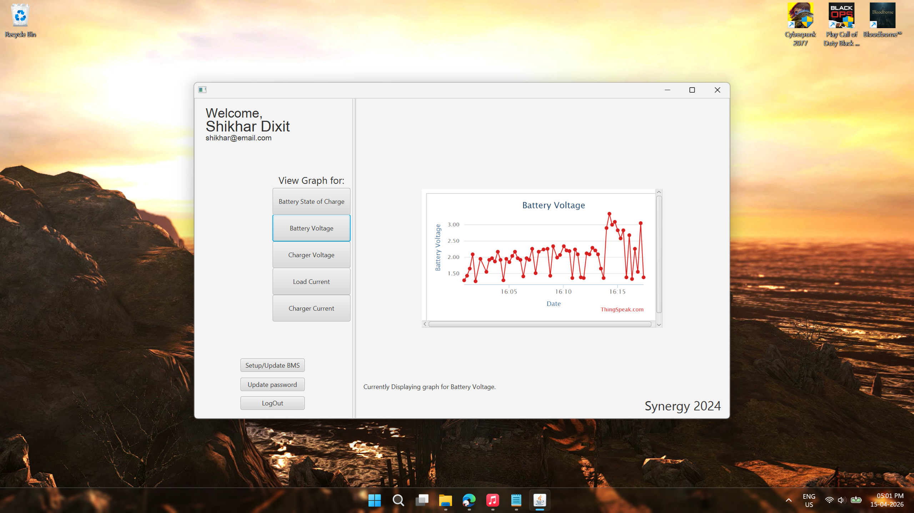
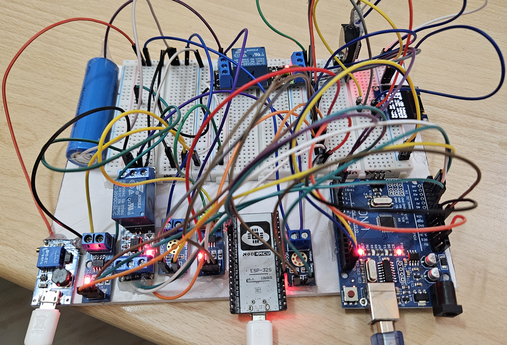
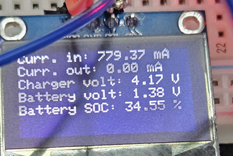
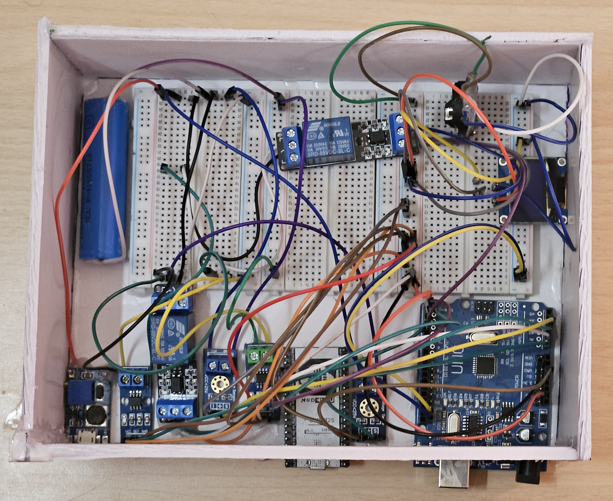

# Synergy2024

#### Introduction

This is a very trivial dashboard JavaFX application, loosely following the MVC architecture. There are no APIs, there are no micro-services, its all monolithic. As long as you have Java-21, you should be able to run provided SmartBMSApp.jar with no other dependencies (its a fat jar, so every dependency is packaged with it)

How to use 
---

The main purpose of the app was to display telemetry data pushed by my IoT BMS device in the form of graphs. For that you don't need anything. Follow these steps: 

1. Simply register a new user account with any random data. 
2. You'll enter into an empty looking dashboard.
3. Click on "Setup/Update BMS"
4. Enter whatever data that you feel like, Except BMS ID, where you need to fill either '2521469' or '2759054', and press Done.
5. If you did the previous step correctly, you should now see a graph rendered each of the fields.

That's it.

Now this all is ephemeral, since no DB connection was made, which means if you close the app and start it again, you'll have to do steps 1-5 all over again.

How it works
---

#### Overview

* The user first either logs in or registers themself. 
* In case of login, if the Database connection was successful, the provided credentials are matched against those in database Users table, and logged in if found, otherwise error is displayed
* In case of register, the new user is added to the database (in case successful connection). Regardless, we now have a UserMngmnt object that will be passed across the Views, retaining this state. 
* The user can't immediately see any graphs, since the BMS details are still empty. Use update BMS to fill in the necessary details. By necessary we mean the BMS ID parameter. 
* The BMS ID parameter is basically the channel ID from Thingspeak. Using their /channels/{id}/charts/ endpoint, it becomes possible to render the entire graph directly. 
* Where does the database fit in all this? The database is simply for user management, maintaining data for multiple users, multiple batteries and multiple BMSs.

#### Source code explanation

This is a very simple app. There are no APIs. It has basic CRUD functionality, for that you need  a MySQL server. The servers config (like the socket, db user's username, password) is hardcoded in /services/UserMngmnt.java. UserMngmnt.java is responsible for all the database CRUD logic. 

It represents the service layer. 

Deep inside src/ you'll find that there is models/ which contains the entities like the BMS, the Battery and the User itself. These correspond to 3 different tables in the MySQL database.

And then, strewn about in the root folder are the Controller files, which handle the JavaFX UI functionality. The state is maintained by the fact that between each view, a UserMngmnt object is passed which itself contains the BMS, Battery, and User objects. This way, we are able to maintain state for a session even without a database. 

Lastly, inside src/main/resources/ you'll find the FXML files, that is the different Views. There a login page, a register page, the dashboard page, and two pages for updating user and BMS info. The dashboard renders the graph directly from the Thingspeak server using WebView.

Future Scope 
---

This project is done for now. It was done the day it was committed. There probably are multiple security flaws (like storing un-hashed passwords directly in the database), but then again, the purpose of the project was to just get it (the UI Dashboard) done. There would probably be no more further changes be made here. 
If I am in the mood, I may add the SQL commands to create the various tables. Other than that the hardcoded parameters can be moved to a env file (since we are using Maven, there should be some way to do that).

However, since this was a really nice concept, inspired from this, I'm developing a new project, also simple but better than this current one. Its called [Synergetic](https://github.com/CinnamonShake45/Synergetic).

Extras
---

Here are some pictures of the actual IoT BMS hardware:

   
  
  

#### That's all for now, Thanks for reading!

